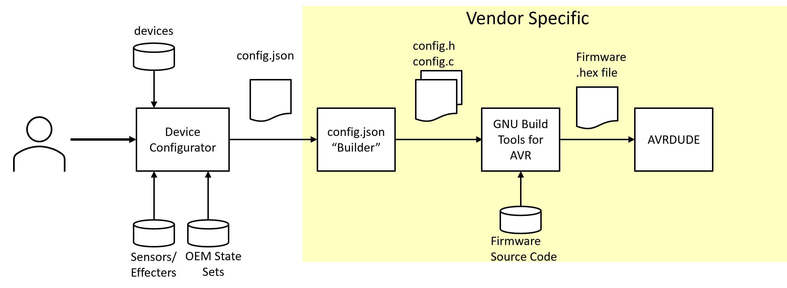

# Exmaple IoT Firmware Builder 

## Overview

This project implements a tool that auto-generates (or builds) code to configure the IoT firmware build process.  The builder tool is not specified in the PICMG(R) IoT.1 (IoT Firmware) specification, however, it is an essential part of the PICMG reference implementation. More information about PICMG IoT.1 can be found on the PICMG website (www.picmg.org).  The builder is one of several reference implementations provided by PICMG to demonstrate implementation of the IoT specifications.

The use case enabled by the PICMG firmware specification involves a user who wishes to create a smart sensor but does not nessarily have the proficiency to create firmware code. The user to creates a firmware configuration using a configurator tool.  The configurator tool, in turn, creates a configuration file that drives the rest of the firmware build process.  The builder, a part of the PICMG "vendor-specific" reference code, converts the configurator output into a C header and soruce file that contans all the necessary macro definitions and data tables it implemnet the user's firmware configuration. This use-case is shown in the following image.

**The PICMG Firmware specification does not dictate the target hardware, however, the builder is intended to be used with the PICMG firmware for a PICMG MicroSAM module based on the Atmega 328PB microcontroller.**

Other example code from PICMG can be found here:
- https://github.com/PICMG/iot_configurator.git - example configurator that allows the user to create constraints-based device configurations for the firmware
- https://github.com/PICMG/iot_firmware.git - example firmware implementation for the Atmega328PB.  This code instantiates many of the features described in the PICMG IoT.1 Firmware Specification.  Run-time features of the code are tuned through use of the configurator and builder tools.
- 
## Build Tools

The PICMG IoT firmware was developed using Visual Studio Code on Linux, and built using the GNU toolchain.  

### Prerequisites:

- Linux OS running Ubuntu 20.04.1 LTS (Focal Fossa).  Other versions of Linux may work but may also require other configuration steps.
- Atmega 328PB-based MicroSAM module (or Arduino Nano for testing with reduced functionality)
- PICMG IoT Firmware (if testing is desired)
- PICMG IoT Configurator (if new configurations are desired)

### Install Build Tools

Enter the following commands on your linux build system to load the required packages for building the firmware

> sudo apt install make

> sudo apt install g++
 
> sudo apt-get install gcc

### Visual Studio Code setup (for Development)

Install the Linux GitHub package for Visual Studio Code
1.	Download and install Visual Studio Code from the Ubuntu Software Center.
2.	Open Visual Studio Code and hit Ctrl+Shift+X to open the extensions window.
3.	Search for and install the C/C++ and C++ Intellisense extensions.
4.	Once the extensions are finished installing, open the Explorer menu at the top left of the screen and click Clone Repository.
5.	In the text box in the top center of the screen, enter the URL for this repository.
6.	When prompted for authentication, follow the on screen directions to authenticate with GitHub using your username and password.
7.	Once the repository clone is done, click on the Source Control tab on the left side of the screen and initialize the repository.

## Build Process

The project can be built and run directly from Visual Studio, or can be built from the command line by changing the working directory to /src/builder and invoking the following command.

> make

## Running the Builder

Invoke the builder from the linux command line with the following command:

> ./builder config_json_filename output_path

